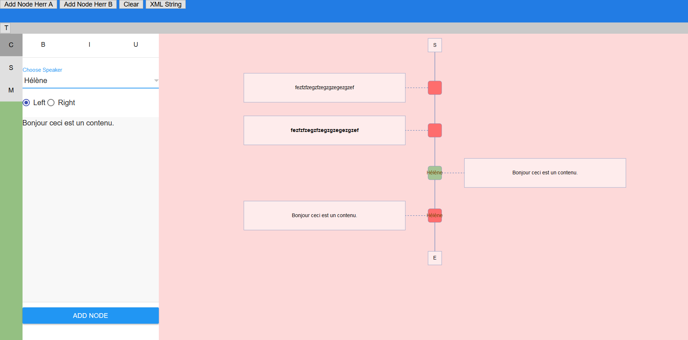
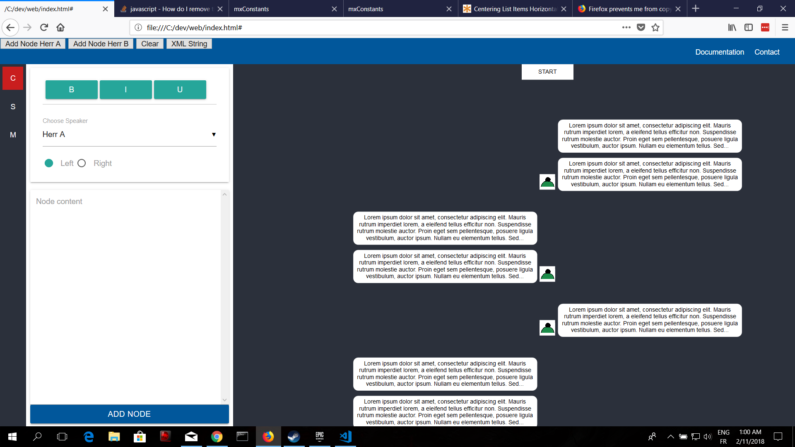
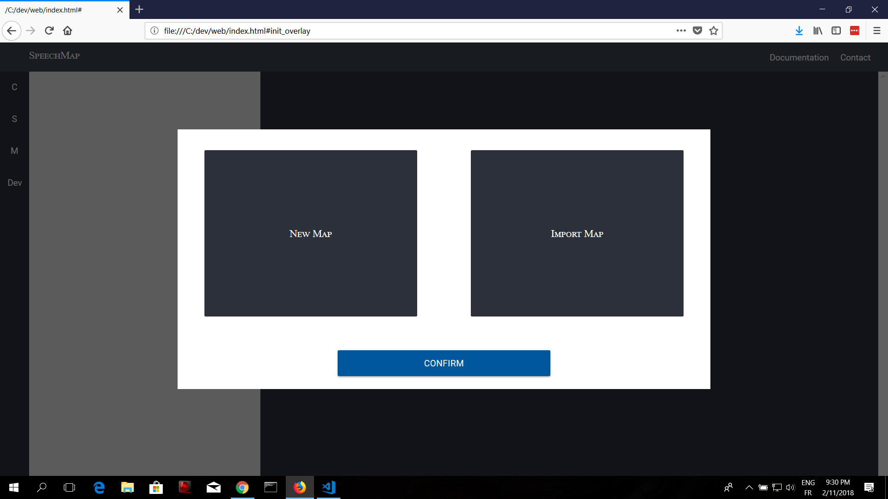
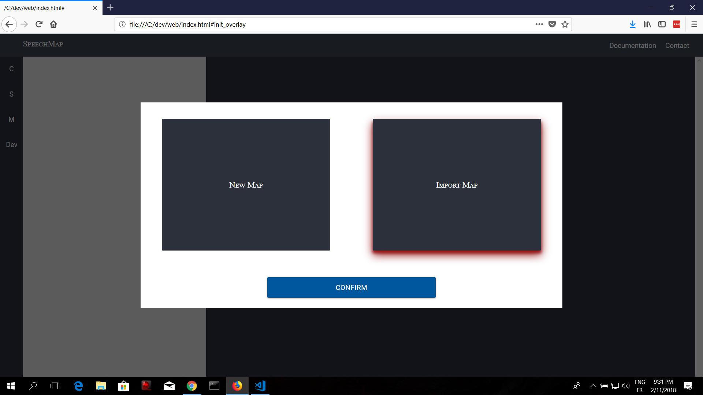
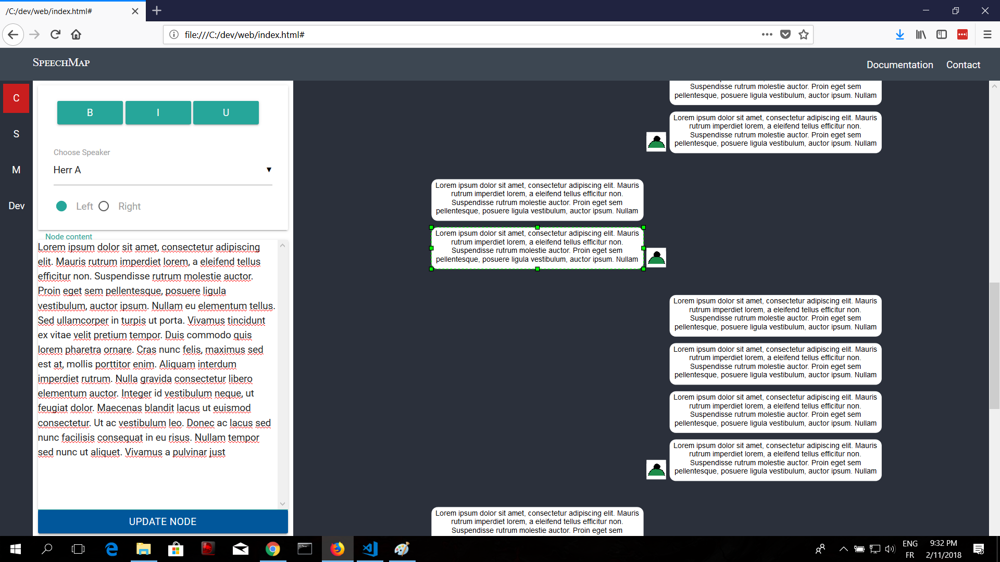
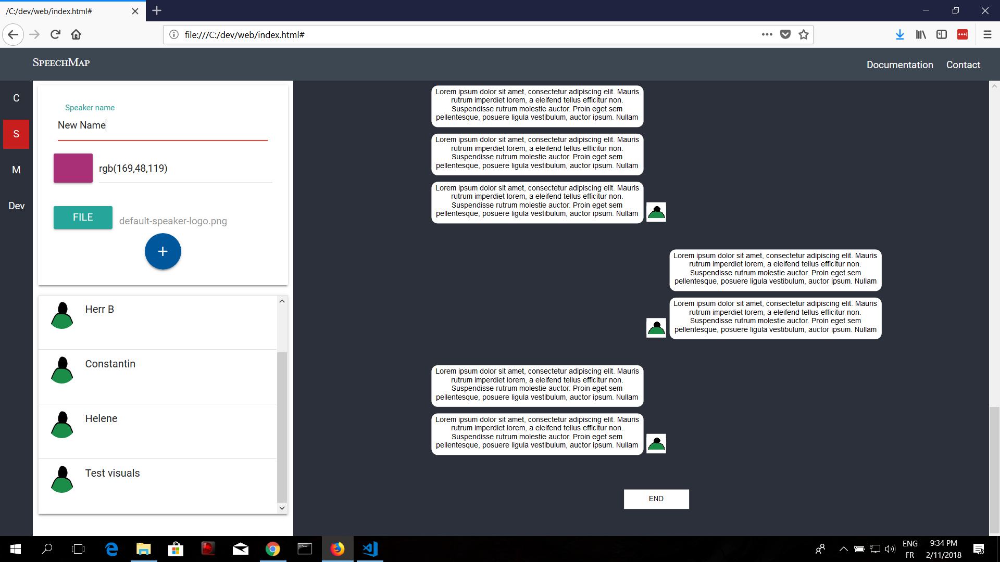
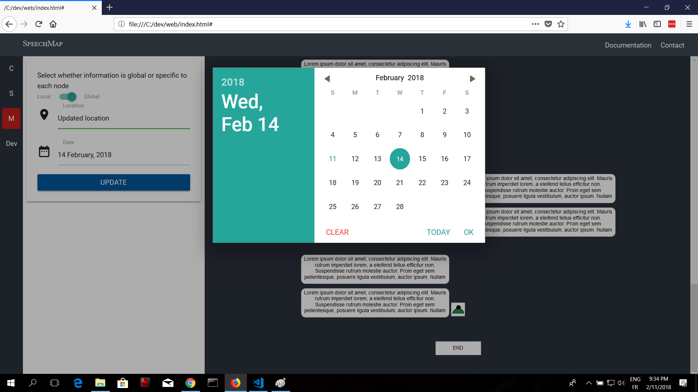

# SpeechMap
Diagrams to represent the flow of speech

2018-1-22: Adding mui and mdl. Visual rework of the editor content tab

2018-2-11: Complete visual rework. 

2018-2-11: Updating the visuals

